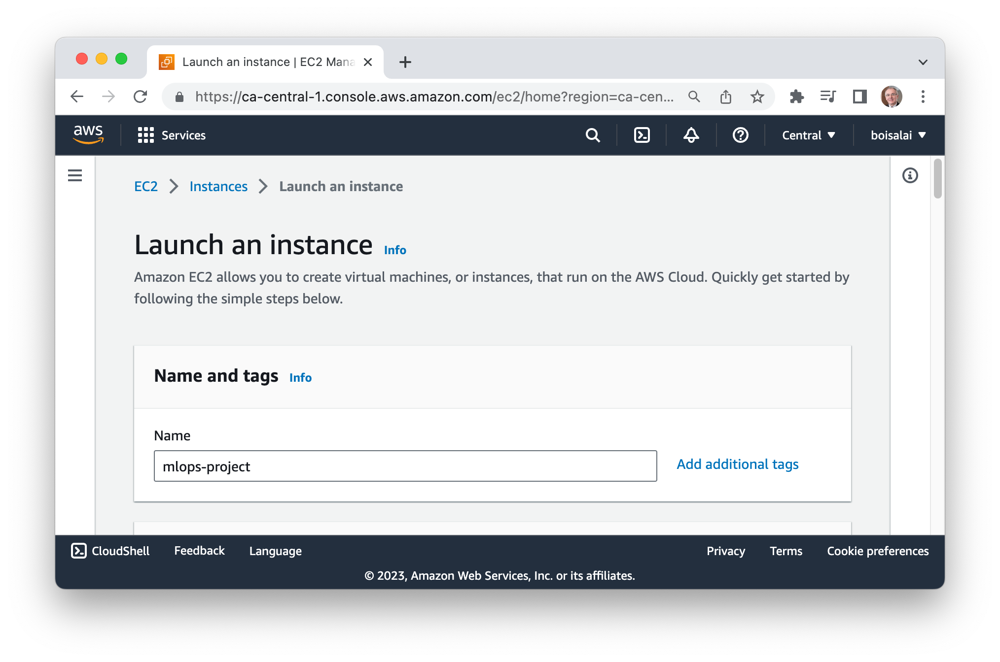
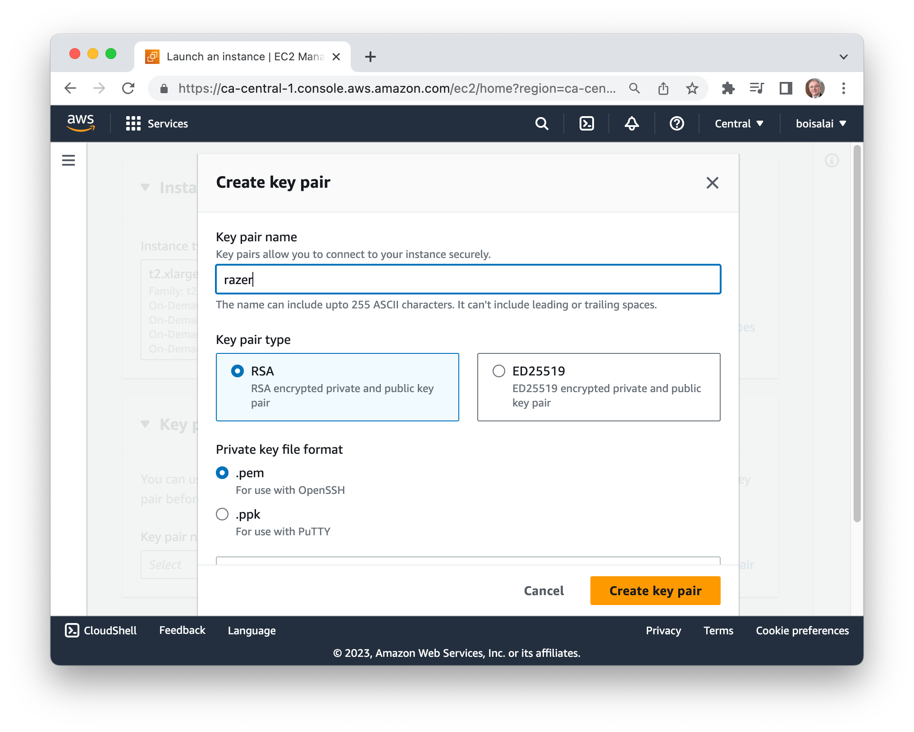
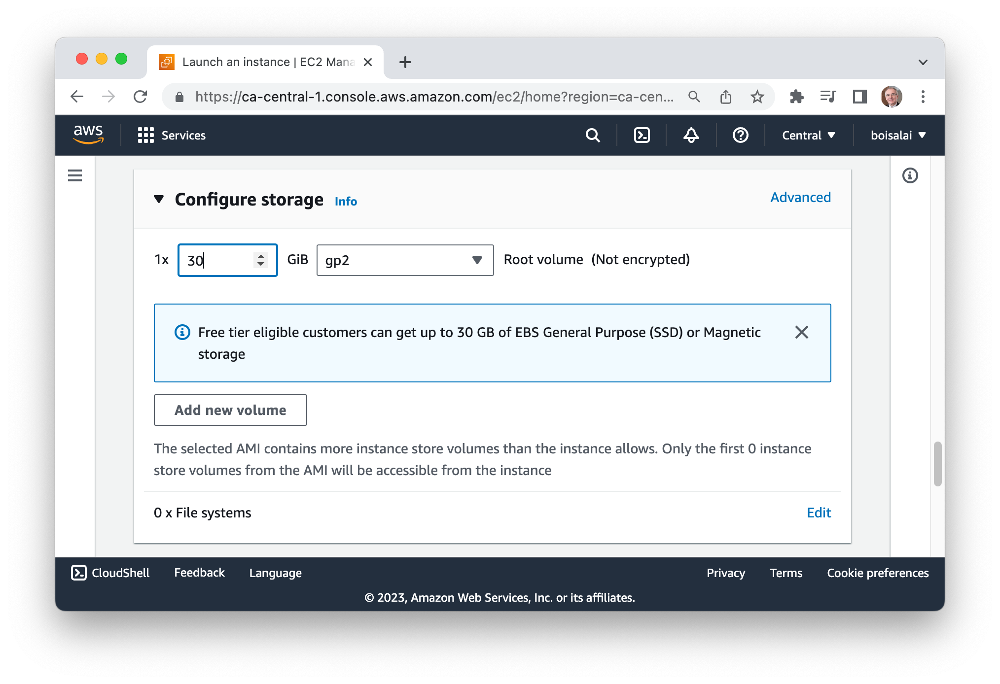
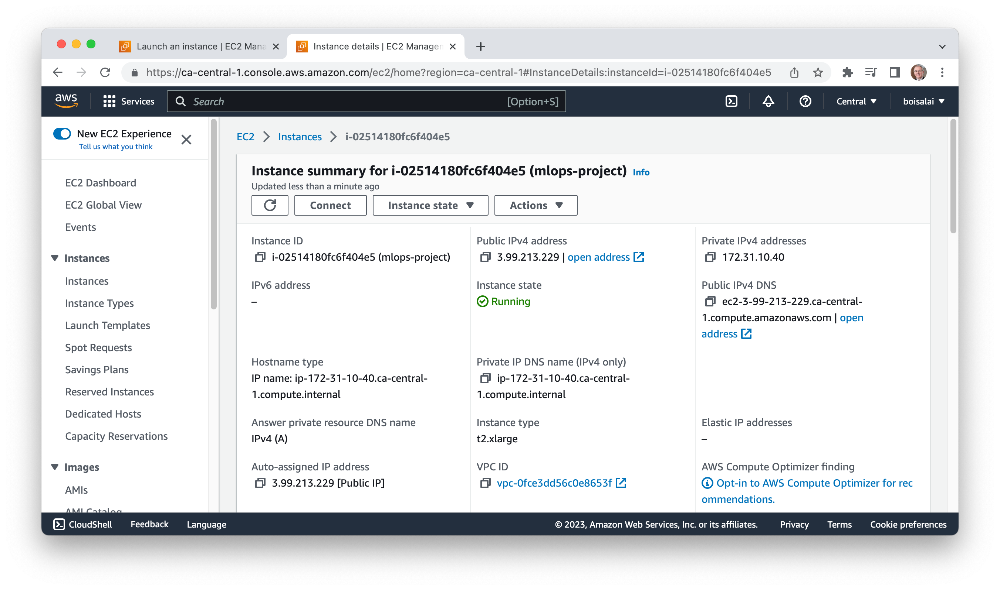
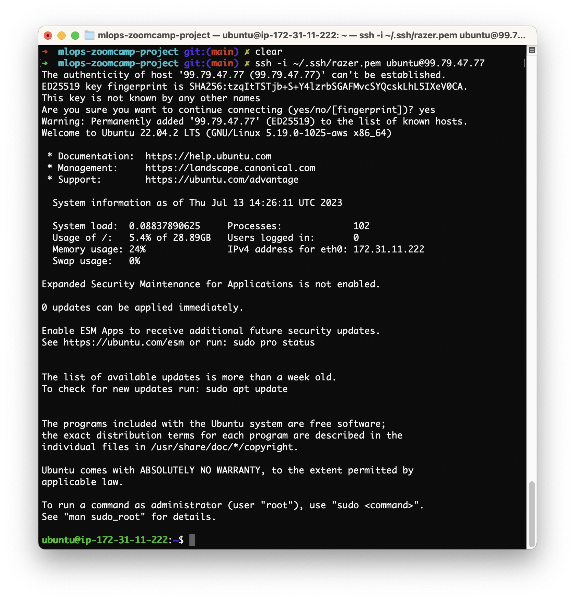
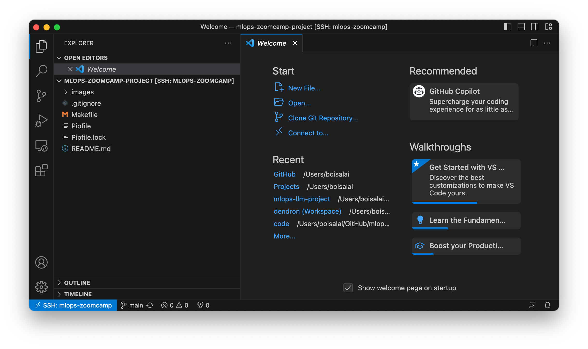
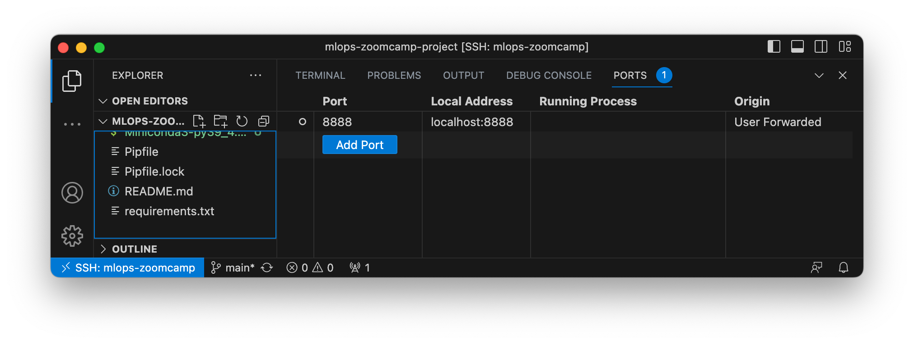
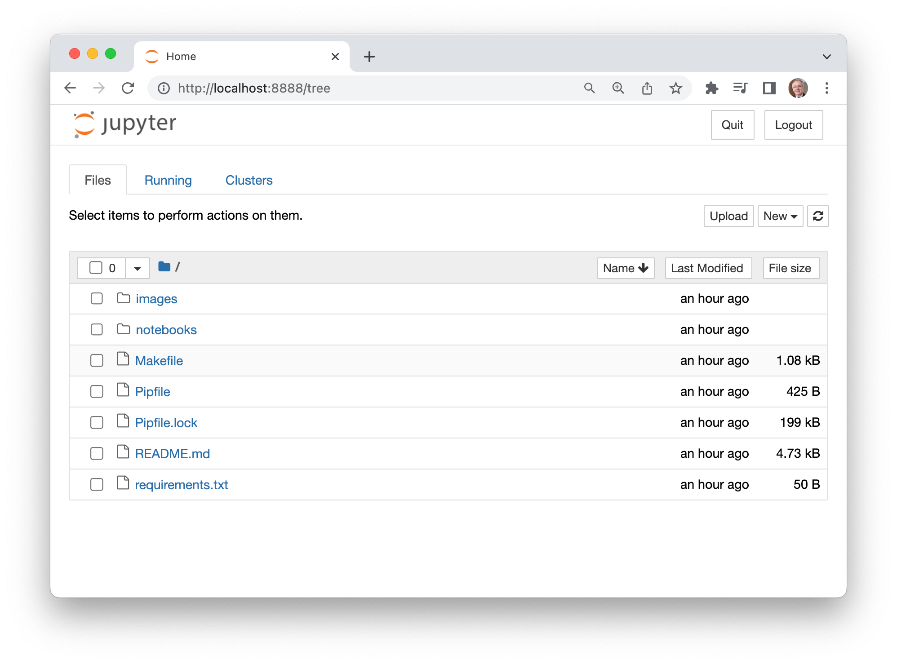

<!--
<p align="center" width="100%"></p>
-->

# Project

## Setup

Follow the steps 1 to 7 below.

### Step 1: Create an AWS Account

Go to [AWS Management Console](https://aws.amazon.com/console/), click on **Create an AWS Account** and follow steps.

Select your **Default Region** (mine is `Canada (Central) ca-central-1`).

### Step 2: Create a new instance

From your **AWS Console**, select **EC2** and then click on **Launch instance**.

Create a new instance with the name **mlops-project**.



Select:

* **Amazon Machine Image (AMI)**: Ubuntu Server 22.04 LTS (HVM), SSD Volume Type
* **Architecture**: 64-bit (x86)


Choose **Instance type**: t2.xlarge.


Click on **Create new key pair** with:

* **Key pair name**: razer
* **Key pair type**: RSA
* **Private key file format**: .pem



Click on **Create key pair** button, than move the downloaded `razer.pem`  file to the `~/.ssh` folder on your local machine.
Than change the permissions to protect the file against the accidental overwriting, removing, renaming or moving files.

```bash
$ mv ~/downloads/razer.pem ~/.ssh
$ chmod 400 ~/.ssh/razer.pem 
```

Increase **Configure storage** to 30 GiB.



Finally, click the **Launch instance** button.

You should see something like this.



Take note of the **Public IPv4 address** (mine is `3.99.132.220`).

### Step 3: Connect local machine to the EC2 instance

Connect to this instance with the following commands.
Don't forget to replace the public IP with your own (mine is `3.99.132.220`).

```bash
$ ssh -i ~/.ssh/razer.pem ubuntu@3.99.132.220
```

You should see this.



We are now connected to the remote service.

Enter `logout` to close the connection.

```bash
$ logout
```

You don't need to run the previous command every time. Just create a config file `~/.ssh/config` like this.

```bash
Host mlops-project
    HostName 3.99.132.220
    User ubuntu
    IdentityFile ~/.ssh/razer.pem
    StrictHostKeyChecking no
```

Now, we can connect to our instance with this command.

```bash
# To connect to our instance. 
$ ssh mlops-project
```

Note that every time we stop and restart the instance, we will have to change the public IP address.

### Step 4: Install required packages on the instance

Run the folowing commands on your instance to install MiniConda, Docker and Docker Compose.

```bash
$ sudo apt update && sudo apt install make
$ git clone https://github.com/boisalai/mlops-zoomcamp-project.git
$ cd mlops-zoomcamp-project
$ make init
```

Log out (with `logout` command) and log back (with `ssh mlops-project` command) in so that your group membership is re-evaluated.

Run the following command on your instance and docker should work fine.

```bash
$ docker run hello-world
``` 

Run the following commands on your instance to create a conda environment and install the other required packages into it.

```bash
$ cd ~/mlops-zoomcamp-project
$ make install
```

### Step 5: Connect Visual Studio Code to your instance

Now, we want access to this remote computer from our Visual Studio Code (VS Code).

Open VS Code from your local machine. 
In VS Code, find and install the **Remote - SSH** extension. 
Then go to the **Command Palette** (`Shift+Cmd+P`), 
select **Remote-SSH: Connect to Host**​, 
select the configured SSH host `mlops-zoomcamp`,
open `mlops-zoomcamp-project` folder and click on **OK**.

We should see this.



### Step 6: Use Jupyter Notebook from remote machine

On your remote instance, run the following command to start jupyter notebook.

```bash
$ conda activate mlops-project 
$ jupyter notebook
```

In VS Code connected to your instance, open a terminal.
From the menu, use the **Terminal > New Terminal** or **View > Terminal** menu commands.
Select **PORTS**, click on **Forward a Port** and open the port `8888`.



Now, if we go to http://localhost:8888/tree, we should see that jupyter notebook is alive.



### Step 7: Authenticating with Kaggle using `kaggle.json`

Navigate to https://www.kaggle.com. 
Then go to the [Account tab of your user profile](https://www.kaggle.com/me/account) and select Create API Token. 
This will trigger the download of `kaggle.json`, a file containing your API credentials.

You need to copy this key on your instance. 
To do so, drag the `kaggle.json` file you downloaded on your local machine 
to the `~/mlops-zoomcamp-project` in the VS Code connected to the instance.


# Je suis rendu ici...


```bash
# Configure your AWS acoount
aws configure
# Create key pair to connect AWS
aws ec2 create-key-pair --region eu-central-1 --key-name mlops --query 'KeyMaterial' --output text > ~/.ssh/mlops.pem
```


```bash
$ pip install -U pip --upgrade pip
$ pip install pipenv
$ git clone https://github.com/boisalai/mlops-zoomcamp-project.git
$ cd mlops-zoomcamp-project
```

Install from Pipfile and activate the Pipenv shell:

```bash
$ pipenv install
$ pipenv shell
$ python --version
Python 3.9.17
```

Connect the environment to a kernel and start jupyter:

```bash
$ python -m ipykernel install --user --display-name pipenv_test --name pipenv_test
$ jupyter notebook
```