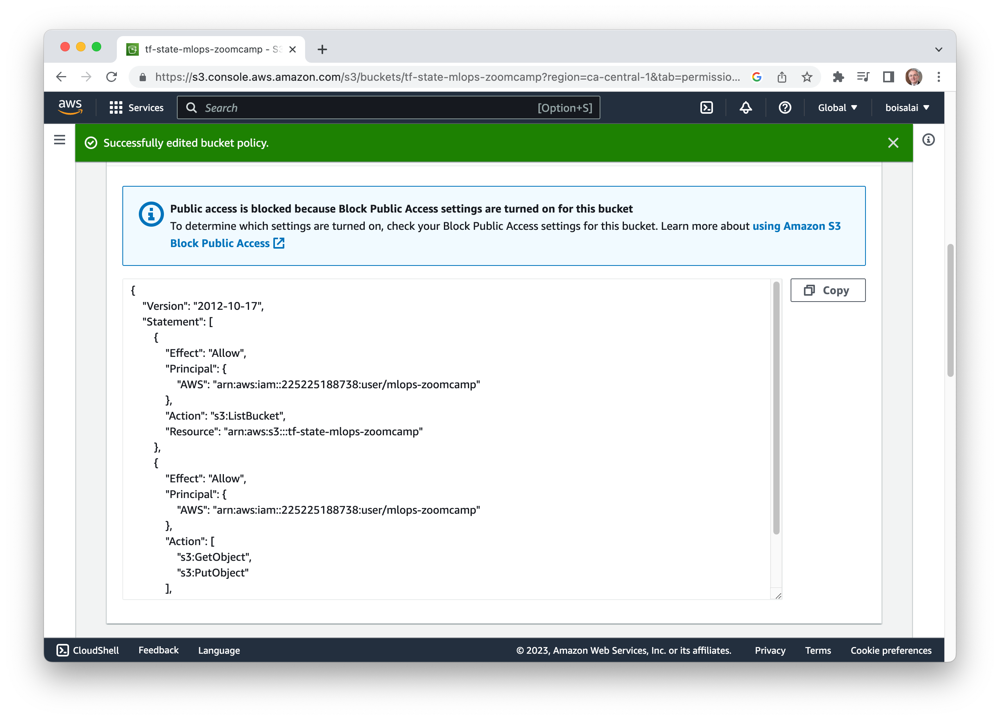

> [!WARNING]  
> This project is in progress and not yet finished.

<div align="center">
<h1>Used Car Price Prediction (MLOps Zoomcamp Project)</h1>


<a href="https://opensource.org/license/mit/">

</a>

[Problem](#problem-statement) | [Dataset](#dataset) | [Architecture](#architecture) 
| [Instructions](#instructions) | [Best practices](#best%20practices) 
| [License](#license) | [Acknowledgments](#acknowledgments)
</div>

## Problem Statement

This project is the capstone associated with 
[MLOps Zoomcamp](https://github.com/DataTalksClub/mlops-zoomcamp), and it will 
undergo peer review and scoring.

The ultimate objective of this project is to create an end-to-end machine learning solution encompassing feature engineering, 
training, validation, tracking, model deployment, hosting for production, and adhering to general engineering best practices. 

The problem at hand is to model the selling price of used cars based on the features given in the datasets. 
It will be used by the client to predict the price of a car of their choice. 

## Dataset

I used [Kaggle's used car data set](https://www.kaggle.com/datasets/austinreese/craigslist-carstrucks-data) 
because it had a variety of categorical and numerical data and allows you to explore different ways of dealing
with missing data.

The Kaggle dataset "austinreese/craigslist-carstrucks-data" is a collection of data on used car prices in Austin,
Texas, scraped from Craigslist. The dataset contains information on various car models, years, and prices, as well
as additional features such as mileage, fuel type, and transmission type.

Here's a breakdown of the dataset's structure:

* The dataset contains 426,880 entries and 26 columns.
* The variables include:
  * `id`: a unique identifier for each car listing
  * `manufacturer`: the make of the vehicle
  * `model`: the model of the vehicle
  * `year`: the year of the vehicle
  * `price`: the listing price of the vehicle
  * `odometer`: the mileage on the vehicle
  * `fuel`: the fuel method of the vehicle (e.g., gasoline, diesel, hybrid)
  * `transmission`: the car's transmission type (e.g., automatic, manual)
  * `posting_date`: the listing date of the vehicle on Craiglist

## Design & flow architecture

The architecture below depicts the system design:

> Section to complete.

## Repository Organization

Our repository organization is shown below. 

- The `notebooks` folder contains ...
- The `infrastructure` folder contains ...
- The `eval` folder contains all ...
- The `inference` folder contains ...
  - <span style="color:hr">[Coming Soon!]</span>  The `train` folder contains all the training code associated with Gorilla finetuning.


```
mlops-zoomcamp-project
├── terraform
│   ├── modules 
│   │   ├── ec2

```

<!--
See https://raw.githubusercontent.com/ShishirPatil/gorilla/main/README.md
-->

## Instructions

Here are the instructions for setting up an AWS EC2 instance and executing the code on this.

### Step 1: Create an AWS Account

Go to [AWS Management Console](https://aws.amazon.com/console/), click on **Create an AWS Account** and follow steps.
Select your **Default Region** (mine is `Canada (Central) ca-central-1`).

### Step 2: Create a user

Go to **IAM** section. From the **IAM dashboard**, under **IAM resources**, click on the number under **Users**.


Click on **Add users** button, enter `mlops-zoomcamp` as **User name**, click on **Next** button.
Click on **Next** button again, then on the **Create user** button.
Select `mlops-zoomcamp` user.

<table>
    <tr>
        <td>
            
        </td>
        <td>
            
        </td>
    </tr>
</table>


Click on **Permissions** tab and on **Add permissions** button.
Select **Attach policies directly**.
Search and select for **AdministrasorAccess** 
then click on **Next** button, then on **Add permissions** button.

### Step 3: Create AWS credentials

Select `mlops-zoomcamp` user.
Click on **Security credentials** tab, and click on **Create access key** button.
Select **Command Line interface (CLI)**, check confirmation below, click **Next**, then click on **Create access key** button.

<table>
    <tr>
        <td>
            
        </td>
        <td>
            
        </td>
    </tr>
</table>


Write down your **Access key** and **Secret access key**.
Keep them in a safe place.
If you lost them, you cannot recover (or) download them again. You will need to create a new API key.

<!--
On your local mahine, set up 
the `AWS_ACCESS_KEY_ID` and `AWS_SECRET_ACCESS_KEY` environment variables with 
the appropriate access keys
previously obtained.

```bash
export AWS_ACCESS_KEY_ID="xxxxxxxxxxxxxxxxxxxx"
export AWS_SECRET_ACCESS_KEY="xxxxxxxxxxxxxxxxxxxxxxxxxxxxxxxxxxxxxxxx"
```
-->

### Step 4: Install and configure AWS CLI

Since we will be working with AWS to provision our infrastructure using Terraform, 
we also need to install 
[AWS CLI](https://docs.aws.amazon.com/cli/latest/userguide/getting-started-install.html). 
Follow the steps listed here, to install the 
latest version of AWS CLI for your OS.

Check installation.

```bash
$ which aws
/usr/local/bin/aws
$ aws --version
aws-cli/2.13.0 Python/3.11.4 Darwin/22.5.0 exe/x86_64 prompt/off
```

Configure `aws-cli` with your AWS **Access key** and **Secret access key**.

```bash
$ aws configure
AWS Access Key ID [None]: xxxxxxxxxxxxxxxxxxxx
AWS Secret Access Key [None]: xxxxxxxxxxxxxxxxxxxxxxxxxxxxxxxxxxxxxxxx
Default region name [ca-central-1]: 
Default output format [None]:
```

Verify aws config.

```bash
$ aws sts get-caller-identity
{
    "UserId": "xxxxxxxxxxxxxxxxxxxxx",
    "Account": "xxxxxxxxxxxx",
    "Arn": "arn:aws:iam::xxxxxxxxxxxx:user/mlops-zoomcamp"
}
```

Write down your **Arn**, you will need it later to configure your AWS S3 bucket.

### Step 5: Create key pair using Amazon EC2

Create a key pair using Amazon EC2. Run this command
to generate the key pair and to save the private key to a `.pem` file.
Then change the permissions to protect the file against the accidental 
overwriting, removing, renaming or moving files.

```bash
aws ec2 create-key-pair \
    --key-name razer \
    --key-type rsa \
    --key-format pem \
    --query "KeyMaterial" \
    --output text > ~/.ssh/razer.pem
chmod 400 ~/.ssh/razer.pem
```

> [!NOTE]  
> If you get an error, you can decode the encoded AWS error message with the following commands.
> `aws sts decode-authorization-message --encoded-message`
> See [decode-authorization-message](https://docs.aws.amazon.com/cli/latest/reference/sts/decode-authorization-message.html).


<!--
### Step 5: Create a conda environment

Create and activate a new environment on your local machine.

```bash
conda create -n mlops-zoomcamp python=3.9
conda activate mlops-zoomcamp
```

If prompted to proceed with the installation (`Proceed ([y]/n)?`), type `y`.
-->

### Step 6: Install Terraform CLI

Download and install Terraform CLI from the [official website](https://www.terraform.io/downloads.html).

To install Terraform on macOS, run this command.

```bash
$ brew install terraform
$ terraform --version
Terraform v1.5.4
on darwin_arm64
```

### Step 7: Clone repository

Clone this [repository](https://github.com/boisalai/mlops-zoomcamp-project.git).

```bash
git clone https://github.com/boisalai/mlops-zoomcamp-project.git
```

### Step 8: Modify Terraform setting

Some changes should be made in the Terreform files.

Change the region for a region near you (if possible, choose a region with low in carbon emissions, mine is `ca-central-1` powered by hydroelectricity).
Make the changes in these files:

* `infrastructure/main.tf`, at line 7.
* `infrastructure/variables.tf`, at line 3.

An AMI (Amazon Machine Image) is a supported and maintained image provided by AWS that provides the information required to launch an instance.
Each AMI has its own unique ID. In order to launch an instance on the EC2 cloud, you first need to locate its ID.

Locate an AMI ID from this [page](http://cloud-images.ubuntu.com/locator/ec2/). 
Select the **Zone** corresponding to your region, select `22.04 LTS` as **Version** and `amd64` as **Architecture**. 
Copy the **AMI-ID** and paste it to the `ami_id` variable in `infrastructure/modules/ec2/variables.tf`, at line 25.


If you don't know your public IP address, open a browser and type into your browser's address space, "what is my IP address" 
the browser will then show your public IP address. Change the variable setting to "your IP address with a /32" subnet mask 
(i.e. "1.2.3.4/32").


https://josephomara.com/tag/terraform-using-security-group-as-an-ingress-rule/

### Step 9: Create AWS resources

Format your Terraform configuration files using the HCL language
standard, including files in subdirectories.

```bash
cd mlops-zoomcamp-project
cd infrastructure
terraform fmt -recursive
```

Run the `terraform init` to install the necessary provider modules, in this case, to support AWS provisioning.

```bash
cd infrastructure
terraform init
```

You should see this.


Run `terraform validate` to validate the AWS provisioning code.

```bash
terraform validate
```

Run `terraform plan` to check what change would be made (you should always do it).

```bash
terraform plan 
```

If you are ok with the plan summary, you can apply the configuration using the following command.
Terraform will ask you if you want to perform these actions. Answer `yes`.

```bash
terraform apply
```

### Step 10: Connect to EC2 instance

```bash
ssh -i ~/.ssh/razer.pem ubuntu@3.96.63.58
```

### Step 11: Start Jupyter


Avais-je vraiment besoin de sudo? et du ssh -i localhost:8888

En tout cas, je sais que je dois ouvrir l'adresse
http://127.0.0.1:8888/tree?token=10238b8ad9dfaf1651e9060fbe642d937deceaff32f68b81

Quelqu'un dit...
Make sure you type https://<jupyter-server-ip> in your browser instead of http://.

```bash
cd mlops-zoomcamp-project
conda activate mlops-zoomcamp
sudo chown -R ubuntu /home/
sudo chown -R ubuntu ~/.local/share/jupyter/
jupyter notebook
```

ssh -i ~/.ssh/razer.pem -L localhost:8888:localhost:8888 ubuntu@3.96.63.58
ssh -L localhost:8888:localhost:8888 ubuntu@3.96.63.58


### Step 9999: Create S3 Bucket

We need to create an S3 bucket manually because Terraform won't create an S3 bucket for us automatically.

Log in to your [AWS Console](https://aws.amazon.com/console/), then go to **S3** section. 
I suppose you don't have any S3 Buckets available. In order to create an S3 bucket, we will click on **Create bucket**.

Enter `tf-state-mlops-zoomcamp` as **Bucket name** and click on **Create bucket**.

<table>
    <tr>
        <td>
            
        </td>
        <td>
            
        </td>
    </tr>
</table>

Now, click on the newly created bucket, select the **Permissions** tab, and click on **Edit** under **Bucket policy** section.

<!--
Ces permissions devraient se retrouver dans Terraform.
-->

Add the following bucket policy:

```json
{
    "Version": "2012-10-17",
    "Statement": [
        {
            "Effect": "Allow",
            "Principal": {
                "AWS": "<your_user_arn>"
            },
            "Action": "s3:ListBucket",
            "Resource": "<your_bucket_arn>"
        },
        {
            "Effect": "Allow",
            "Principal": {
                "AWS": "<your_user_arn>"
            },
            "Action": [
                "s3:GetObject",
                "s3:PutObject"
            ],
            "Resource": "<your_bucket_arn>/*"
        }
    ]
}
```

<!--
{
    "Version": "2012-10-17",
    "Statement": [
        {
            "Effect": "Allow",
            "Principal": {
                "AWS": "AIDATI4DXUWBELI552XQJ"
            },
            "Action": "s3:ListBucket",
            "Resource": "arn:aws:s3:::tf-state-mlops-zoomcamp"
        },
        {
            "Effect": "Allow",
            "Principal": {
                "AWS": "AIDATI4DXUWBELI552XQJ"
            },
            "Action": [
                "s3:GetObject",
                "s3:PutObject"
            ],
            "Resource": "arn:aws:s3:::tf-state-mlops-zoomcamp/*"
        }
    ]
}
-->

Replace `<your_user_arn>` and `<your_bucket_arn>` with the appropriate values. 
You can get your **user arn** from the command line by running `aws sts get-caller-identity`. See above (mine is `AIDATI4DXUWBELI552XQJ`).

Your **Bucket ARN** can be found in the **Properties** tab of the S3 bucket (mine is `arn:aws:s3:::tf-state-mlops-zoomcamp`).


You should have something like this.



Click on **Save changes** button.

<!--
See [Configure S3 bucket as Terraform backend, Step-by-Step](https://www.golinuxcloud.com/configure-s3-bucket-as-terraform-backend/) for more information.
-->


<!--


Pour faire fonctionner Jupyter...
https://saturncloud.io/blog/how-to-setup-jupyter-notebook-on-ec2/


You should see this.


We are now connected to the remote service.

Enter `logout` to close the connection.

```bash
$ logout
```

You don't need to run the previous command every time. Just create a config file `~/.ssh/config` like this.

```bash
Host mlops-zoomcamp
    HostName 3.99.132.220
    User ubuntu
    IdentityFile ~/.ssh/razer.pem
    StrictHostKeyChecking no
```

Now, we can connect to our instance with this command.

```bash
# To connect to our instance. 
$ ssh mlops-zoomcamp
```

Note that every time we stop and restart the instance, we will have to change the public IP address.

### Step 4: Install required packages on the instance

Run the folowing commands on your instance to install MiniConda, Docker and Docker Compose, 
and create a conda environment.

```bash
$ sudo apt update && sudo apt install make
$ git clone https://github.com/boisalai/mlops-zoomcamp-project.git
$ cd mlops-zoomcamp-project
$ make init
```

Log out (with `logout` command) and log back (with `ssh mlops-zoomcamp` command) in so that your group membership is re-evaluated
and changes to take effect.

```bash
$ logout
Connection to 3.99.132.220 closed.
$ ssh mlops-zoomcamp
``````

Run the following command on your instance and docker should work fine.

```bash
$ docker run hello-world
``` 

Run the following commands on your instance to activate the conda environment and install the required packages into it.

```bash
$ cd ~/mlops-zoomcamp-project
$ conda create -n mlops-zoomcamp python==3.9
$ conda activate mlops-zoomcamp
$ pip install -r requirements.txt
```

### Step 5: Connect Visual Studio Code to your instance

Now, we want access to this remote computer from our Visual Studio Code (VS Code).

Open VS Code from your local machine. 
In VS Code, find and install the **Remote - SSH** extension. 
Then go to the **Command Palette** (`Shift+Cmd+P`), 
select **Remote-SSH: Connect to Host**​, 
select the configured SSH host `mlops-zoomcamp`,
open `mlops-zoomcamp-project` folder and click on **OK**.

We should see this.


### Step 6: Use Jupyter Notebook from remote machine

On your remote instance, run the following command to start Jupyter notebook.

```bash
$ conda activate mlops-zoomcamp 
$ jupyter notebook
```

In VS Code connected to your instance, open a terminal.
From the menu, use the **Terminal > New Terminal** or **View > Terminal** menu commands.
Select **PORTS**, click on **Forward a Port** and open the port `8888`.


Copy and paste one of the URLs (I have http://localhost:8888/?token=c8de56fa...) to the web browser, 
you should see that Jupyter notebook is alive.


-->


### Step 9: Create a config file

These [instructions](https://docs.aws.amazon.com/AWSEC2/latest/UserGuide/AccessingInstancesLinux.html) 
explain how to connect to your Linux instance using an SSH client, AWS CLI or SCP client. 

Use the following command to SSH into your EC2 instance.
Replace the public IP address of your EC2 instance (mine is `15.223.76.161`).

```bash
ssh -i ~/.ssh/razer.pem ubuntu@15.223.119.162
```

We are now connected to the remote service.

Enter `logout` to close the connection.

You don't need to run the previous command every time. Just create a config file `~/.ssh/config` like this.
Replace the public IP with your own (mine is `3.99.247.184`).

```bash
Host mlops-zoomcamp
    HostName 3.99.247.184
    User ubuntu
    IdentityFile ~/.ssh/razer.pem
    StrictHostKeyChecking no
```

Now, we can connect to our instance with this command.

```bash
ssh mlops-zoomcamp
```

We are now connected to the remote service.

Enter `logout` to close the connection.

Note that every time we stop and restart the instance, we will have to change the public IP address.

### Step 9: Authentication to use the Kaggle's public API

The `kaggle.json` file is typically used to authenticate API requests to the Kaggle service. 
It contains the necessary credentials for the Kaggle API, allowing you to interact with Kaggle datasets, competitions, and other 
resources programmatically.

Navigate to https://www.kaggle.com. Go to the [Account tab of your user profile](https://www.kaggle.com/me/account) and select Create API Token. 
This will trigger the download of `kaggle.json`, a file containing your API credentials.

Load the `kaggle.json` file to the instance with the 
following command after changing the **Public IPv4 DNS** (mine is `ec2-3-99-132-220.ca-central-1.compute.amazonaws.com`).

```bash
scp -i ~/.ssh/razer.pem ~/downloads/kaggle.json ubuntu@ec2-3-99-132-220.ca-central-1.compute.amazonaws.com:~/mlops-zoomcamp-project
```


### Step 10: Start Prefect

Start a local Prefect server by running the following.

```bash
$ prefect server start
```

You should see this.

```txt
 ___ ___ ___ ___ ___ ___ _____ 
| _ \ _ \ __| __| __/ __|_   _| 
|  _/   / _|| _|| _| (__  | |  
|_| |_|_\___|_| |___\___| |_|  

Configure Prefect to communicate with the server with:

    prefect config set PREFECT_API_URL=http://127.0.0.1:4200/api

View the API reference documentation at http://127.0.0.1:4200/docs

Check out the dashboard at http://127.0.0.1:4200
```

Open another terminal window and run the following commands to set the Prefect API URL.

```bash
$ conda activate mlops-zoomcamp
$ prefect config set PREFECT_API_URL=http://localhost:4200/api
```

You should see this.

```txt
Set 'PREFECT_API_URL' to 'http://127.0.0.1:4200/api'.
Updated profile 'default'.
```

Open the Prefect Dashboard at http://127.0.0.1:4200. You should see this.


### Step 11: Start MLflow UI

```bash
$ mlflow ui --backend-store-uri sqlite:///mlflow.db
```

Then, open the MLflow UI on http://127.0.0.1:5000/. You should see this.


### Step 12: Train the model

In another terminal, run the following commands.

```bash
$ conda activate mlops-zoomcamp
$ make train
```

This step involves the following tasks:

* Downloading the data from Kaggle.
* Performing feature engineering on the data.
* Preparing the datasets for training.
* Training the model using multiple hyperparameter combinations.
* Re-training the model using the best hyperparameters.
* Registering the model in the MLFlow staging area.
* All of these tasks are orchestrated using Prefect.
  
You should see something like this.

<table>
    <tr>
        <td>
            <b>Terminal<b><br>
            
        </td>
        <td>
            <b>Prefect Dashboard<b><br>
            
        </td>
        <td>
            <b>Prefect Dashboard<b><br>
            
        </td>
    </tr>
</table>

### Step 13: Test

```bash
$ make test
```

TODO

### Step 14: Deploy the model

```bash
$ make deploy 
```

### Step 15: Destroy your image

Avoid unnecessary charges in your AWS account by destroying your instance in Terraform.

```bash
terraform destroy -auto-approve
```


## References

* [Deploying a Machine Learning development environment in less than 5 minutes](https://www.manuelpasieka.com/projects/ml_dev_deployment_on_aws/)
* [](https://towardsdatascience.com/choosing-the-right-gpu-for-deep-learning-on-aws-d69c157d8c86)
* https://aws.amazon.com/ec2/instance-types/

## License

[MIT License](LICENSE)

## Acknowledgments

I am deeply grateful for the effort this fantastic group of individuals has invested in ensuring our understanding of the different facets of MLOps.

* [Alexey Grigorev](https://github.com/alexeygrigorev)
* Cristian Martinez (MLflow)
* [Jeff Hale](https://github.com/discdiver) (Prefect)
* Bianca Hoch (Prefect)
* [Emeli Dral](https://github.com/emeli-dral) (Evidently)
* [Sejal Vaidya](https://github.com/sejalv) (IaC and Terraform)
