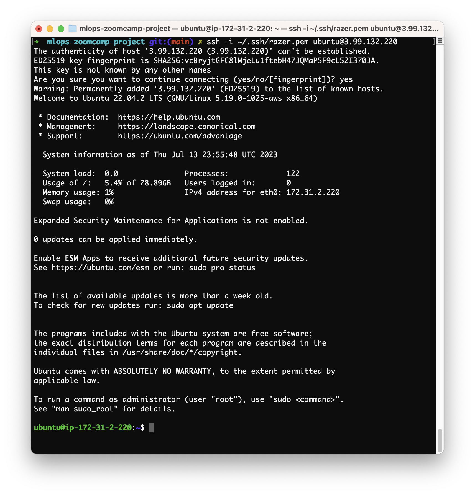

> [!WARNING]  
> This project is in progress and not yet finished.

# Used Car Price Prediction (MLOps Zoomcamp Project)

Capstone project carried out as part of the MLOps Zoomcamp 2023.

[](https://github.com/vshymanskyy/StandWithUkraine/blob/main/docs/README.md)


## Problem Statement

This project is the culmination of the [MLOps Zoomcamp](https://github.com/DataTalksClub/mlops-zoomcamp).

The primary goal of this project is to create an end-to-end machine learning solution that covers various stages, 
including feature engineering, model training, validation, tracking, model deployment, production hosting, 
and adherence to general engineering best practices.

The task at hand involves modeling the selling price of used cars based on the features provided in the datasets. 
The resulting model will be utilized by the client to predict the price of their desired car.

## Dataset

The Kaggle dataset 
[austinreese/craigslist-carstrucks-data](https://www.kaggle.com/datasets/austinreese/craigslist-carstrucks-data) 
is a collection of data on used car prices in Austin,
Texas, scraped from Craigslist. The dataset contains information on various car models, years, and prices, as well
as additional features such as mileage, fuel type, and transmission type.

The Kaggle dataset 
[austinreese/craigslist-carstrucks-data](https://www.kaggle.com/datasets/austinreese/craigslist-carstrucks-data) 
compiles data on used car prices in Austin, Texas, obtained by scraping Craigslist. 
The dataset comprises details about different car models, years, and prices, along with additional 
features such as mileage, fuel type, and transmission type.

Here's a breakdown of the dataset's structure:

* The dataset contains 426,880 entries and 26 columns.
* The variables include:
  * `id`: a unique identifier for each car listing
  * `manufacturer`: the make of the vehicle
  * `model`: the model of the vehicle
  * `year`: the year of the vehicle
  * `price`: the listing price of the vehicle
  * `odometer`: the mileage on the vehicle
  * `fuel`: the fuel method of the vehicle (e.g., gasoline, diesel, hybrid)
  * `transmission`: the car's transmission type (e.g., automatic, manual)
  * `posting_date`: the listing date of the vehicle on Craiglist

## Design & flow architecture

The architecture below depicts the system design:

:x: Section to complete.

## Repository Organization

Our repository organization is shown below. 

* The `notebooks` folder contains ...
* The `infrastructure` folder contains ...
* The `eval` folder contains all ...
* The `inference` folder contains ...

```
mlops-zoomcamp-project
├── terraform
│   ├── modules 
│   │   ├── ec2

```

:x: Section to complete.

## Instructions

Here are the instructions for set up an AWS EC2 instance and executing the code on it.

### Step 1: Create an AWS Account

1. Go to the [AWS Management Console](https://aws.amazon.com/console/). 
Click on **Create an AWS Account** and follow the provided steps to create your AWS account.
2. Once you have created your account, log in to the **AWS Management Console**.
3. Select your **Default Region** from the available options. For example, if you are in Canada, you can 
choose `Canada (Central) ca-central-1` as your default region.
4. If you are uncertain about the specific region to select, you can refer to 
the [AWS Regions and Availability zones](https://docs.aws.amazon.com/AWSEC2/latest/UserGuide/using-regions-availability-zones.html) 
documentation to find your region name based on your location.

### Step 2: Create a user

Go to **IAM** section. From the **IAM dashboard**, under **IAM resources**, click on the number under **Users**.


Click on **Add users** button, enter `mlops-zoomcamp` as **User name**, click on **Next** button.
Click on **Next** button again, then on the **Create user** button.

<table>
    <tr>
        <td>
            
        </td>
        <td>
            
        </td>
    </tr>
</table>

Select `mlops-zoomcamp` user. You should see something like this.


Click on the **Permissions tab**. Click on the **Add permissions** button.
Select **Attach policies directly**.
Search and select for **AdministratorAccess**.
Then click on the **Next** button, then on the **Add permissions** button.

### Step 3: Create AWS credentials

In AWS console, select `mlops-zoomcamp` user.
Click on **Security credentials** tab, and click on **Create access key** button.
Select **Command Line interface (CLI)**, check confirmation below, click **Next**, then click on **Create access key** button.

<table>
    <tr>
        <td>
            
        </td>
        <td>
            
        </td>
    </tr>
</table>

You should see something like this.


Write down your **Access key** and **Secret access key**.
Keep them in a safe place.
If you lost them, you cannot recover them again. You will need to create a new API key.

### Step 4: Install and configure AWS CLI

Terraform needs the AWS CLI installed in order to make API calls. 
Follow [these instructions](https://docs.aws.amazon.com/cli/latest/userguide/getting-started-install.html) to install it as well 
as configure the CLI with your access key and secret key.

Check installation.

```bash
$ which aws
/usr/local/bin/aws
$ aws --version
aws-cli/2.13.0 Python/3.11.4 Darwin/22.5.0 exe/x86_64 prompt/off
```

Configure AWS CLI with your AWS **Access key** and **Secret access key**.

```bash
$ aws configure
AWS Access Key ID [None]: xxxxxxxxxxxxxxxxxxxx
AWS Secret Access Key [None]: xxxxxxxxxxxxxxxxxxxxxxxxxxxxxxxxxxxxxxxx
Default region name [ca-central-1]: 
Default output format [None]:
```

Verify aws config.

```bash
$ aws sts get-caller-identity
{
    "UserId": "xxxxxxxxxxxxxxxxxxxxx",
    "Account": "xxxxxxxxxxxx",
    "Arn": "arn:aws:iam::xxxxxxxxxxxx:user/mlops-zoomcamp"
}
```

Write down your **Arn** (the Amazon Resource Name associated with the calling identity), 
you will need it later to configure your AWS S3 bucket.

### Step 5: Create S3 Bucket

We need to create an S3 bucket manually because Terraform won't create it automatically for us.

In the [AWS Console](https://aws.amazon.com/console/), go to **S3** section.
I suppose you don't have any S3 Buckets available. In order to create an S3 bucket, click on **Create bucket**.

Enter `tf-state-mlops-zoomcamp` as **Bucket name** and change the **AWS Region** if necessary.
Then click on **Create bucket**.

<table>
    <tr>
        <td>
            
        </td>
        <td>
            
        </td>
    </tr>
</table>

Now, click on the newly created bucket, select the **Permissions** tab, and click on **Edit** under **Bucket policy** section.

Add the following bucket policy:

```json
{
    "Version": "2012-10-17",
    "Statement": [
        {
            "Effect": "Allow",
            "Principal": {
                "AWS": "<your_user_arn>"
            },
            "Action": "s3:ListBucket",
            "Resource": "<your_bucket_arn>"
        },
        {
            "Effect": "Allow",
            "Principal": {
                "AWS": "<your_user_arn>"
            },
            "Action": [
                "s3:GetObject",
                "s3:PutObject"
            ],
            "Resource": "<your_bucket_arn>/*"
        }
    ]
}
```

```
{
    "Version": "2012-10-17",
    "Statement": [
        {
            "Effect": "Allow",
            "Principal": {
                "AWS": "AIDATI4DXUWBELI552XQJ"
            },
            "Action": "s3:ListBucket",
            "Resource": "arn:aws:s3:::tf-state-mlops-zoomcamp"
        },
        {
            "Effect": "Allow",
            "Principal": {
                "AWS": "AIDATI4DXUWBELI552XQJ"
            },
            "Action": [
                "s3:GetObject",
                "s3:PutObject"
            ],
            "Resource": "arn:aws:s3:::tf-state-mlops-zoomcamp/*"
        }
    ]
}
```

Make sure to replace `<your_user_arn>` and `<your_bucket_arn>` with the appropriate values. 

Replace `<your_user_arn>` with the `UserId` obtained before 
by running `aws sts get-caller-identity` (mine is `AIDATI4DXUWBELI552XQJ`).

Replace `<your_bucket_arn>` with the 
**Bucket ARN** that can be found in the **Properties** tab of the S3 bucket (mine is `arn:aws:s3:::tf-state-mlops-zoomcamp`).


You should have something like this.


Click on **Save changes** button.

### Step 6: Create key pair using Amazon EC2

Create a key pair using Amazon EC2. Run this command
to generate the key pair and to save the private key to a `.pem` file.
Then change the permissions to protect the file against the accidental 
overwriting, removing, renaming or moving files.

```bash
aws ec2 create-key-pair \
    --key-name razer \
    --key-type rsa \
    --key-format pem \
    --query "KeyMaterial" \
    --output text > ~/.ssh/razer.pem
chmod 400 ~/.ssh/razer.pem
```

> [!NOTE]  
> If you get an error, you can decode the encoded AWS error message with the following commands: <br>
> `aws sts decode-authorization-message --encoded-message`<br>
> See [decode-authorization-message](https://docs.aws.amazon.com/cli/latest/reference/sts/decode-authorization-message.html).

### Step 7: Install Terraform CLI

Download and install Terraform CLI from the [official website](https://www.terraform.io/downloads.html).

To install Terraform on macOS, run this command.

```bash
$ brew install terraform
$ terraform --version
Terraform v1.5.4
on darwin_arm64
```

### Step 8: Clone repository

Clone this [repository](https://github.com/boisalai/mlops-zoomcamp-project.git) on your local machine.

```bash
git clone https://github.com/boisalai/mlops-zoomcamp-project.git
cd mlops-zoomcamp-project
```

### Step 9: Adjust Terraform settings

Some changes should be made in the Terreform setting.

In the `infrastructure/variables.tf`, change the `aws_region` variable for a 
region near you (ideally, choose a region with low in carbon emissions, 
mine is `ca-central-1` powered by hydroelectricity).

In the `infrastructure/main.tf`, change the region of the S3 bucket.

In the `infrastructure/modules/ec2/variables.tf`, change the `ingress_cidr_blocks` 
variable for your IP address followed by `/32`.

If you are unsure of your public IP address, open a web browser and type "what is my IP address" into the browser's address bar. 
The browser will display your public IP address. Now, modify the variable setting to include a subnet mask of `/32` like this: `1.2.3.4/32`.

### Step 10: Create AWS resources

Run the `terraform init` to install the necessary provider modules, in this case, to support AWS provisioning.

```bash
cd infrastructure
terraform init
```

You should see this.


Run `terraform validate` to validate the AWS provisioning code.

```bash
terraform validate
```

Run `terraform plan` to check what change would be made (you should always do it).

```bash
terraform plan 
```

If you are OK with the plan summary, you can apply the configuration using the following command.
Terraform will ask you if you want to perform these actions. Answer `yes`.

```bash
terraform apply
```

This command should take a few minutes since in addition to creating the EC2 instance, 
it install conda, docker, make, clone the repository, create a conda environment and install the required packages.

Go to [AWS Management Console](https://aws.amazon.com/console/), then go to **EC2** section. 
Under **Resources**, click on **Instances (running)**.
Select `mlops-zoomcamp-ec2` and copy the **Public IPv4 address** for the next step.

### Step 11: Connect to EC2 instance 

These [instructions](https://docs.aws.amazon.com/AWSEC2/latest/UserGuide/AccessingInstancesLinux.html) 
explain how to connect to your Linux instance using an SSH client, AWS CLI or SCP client. 

Use the following command to SSH into your EC2 instance.
Replace the public IP address of your EC2 instance (mine is `15.223.76.161`).
Answer `yes` to the question.

```bash
$ ssh -i ~/.ssh/razer.pem ubuntu@3.98.58.87
The authenticity of host 'XX.XX.XX.XX (XX.XX.XX.XX)' can't be established.
ED255XX key fingerprint is SHA256:xxxxxxxxxxxxxxxxxxxxxxxxxxxxxxxxxxxxxxxxxxx.
This key is not known by any other names
Are you sure you want to continue connecting (yes/no/[fingerprint])? 
```

We are now connected to the remote service.
You should see this.



Enter `logout` to close the connection.

```bash
logout
```

You don't need to run the previous command every time. Just create a config file `~/.ssh/config` like this.

```bash
Host mlops-zoomcamp
    HostName 3.99.132.220
    User ubuntu
    IdentityFile ~/.ssh/razer.pem
    StrictHostKeyChecking no
```

Now, we can connect to our instance with this command.

```bash
ssh mlops-zoomcamp
```

Note that every time we stop and restart the instance, we will have to change the public IP address.

### Step 12: Connect VS Code to your instance (optional)

Now, we want access to this remote computer from our Visual Studio Code (VS Code).

Open VS Code from your local machine. 
In VS Code, find and install the **Remote - SSH** extension. 
Then go to the **Command Palette** (`Shift+Cmd+P`), 
select **Remote-SSH: Connect to Host**​, 
select the configured SSH host `mlops-zoomcamp`,
open `mlops-zoomcamp-project` folder and click on **OK**.

We should see this.


### Step 13: Start Jupyter notebook (optional)

Use the following command to SSH into your EC2 instance.
Replace the public IP address of your EC2 instance (mine is `15.223.76.161`).
Answer `yes` to the question.

```bash
ssh -i ~/.ssh/razer.pem -L localhost:8888:localhost:8888 ubuntu@3.98.58.87
```

On the remote instance, run the following commands:

```bash
cd mlops-zoomcamp-project
conda activate mlops-zoomcamp
sudo chown -R ubuntu /home/
sudo chown -R ubuntu ~/.local/share/jupyter/
jupyter notebook
```

Copy and paste to uour local browsewr the second URL starting with `http://127.0.0.1:8888/tree?token=`.

You should see this.

TODO

In VS Code connected to your instance, open a terminal.
From the menu, use the **Terminal > New Terminal** or **View > Terminal** menu commands.
Select **PORTS**, click on **Forward a Port** and open the port `8888`.


Copy and paste one of the URLs (I have http://localhost:8888/?token=c8de56fa...) to the web browser, 
you should see that Jupyter notebook is alive.


### Step 14: Authentication to use the Kaggle's public API

The `kaggle.json` file is typically used to authenticate API requests to the Kaggle service. 
It contains the necessary credentials for the Kaggle API, allowing you to interact with Kaggle datasets, competitions, and other 
resources programmatically.

Navigate to https://www.kaggle.com. Go to the [Account tab of your user profile](https://www.kaggle.com/me/account) and select Create API Token. 
This will trigger the download of `kaggle.json`, a file containing your API credentials.

Load the `kaggle.json` file to the instance with the 
following command after changing the **Public IPv4 DNS** (mine is `ec2-3-99-132-220.ca-central-1.compute.amazonaws.com`).

```bash
scp -i ~/.ssh/razer.pem ~/downloads/kaggle.json ubuntu@ec2-3-99-132-220.ca-central-1.compute.amazonaws.com:~/mlops-zoomcamp
```

### Step 15: Start Prefect

Start a local Prefect server by running the following.

```bash
conda activate mlops-zoomcamp
prefect server start
```

You should see this.

```txt
 ___ ___ ___ ___ ___ ___ _____ 
| _ \ _ \ __| __| __/ __|_   _| 
|  _/   / _|| _|| _| (__  | |  
|_| |_|_\___|_| |___\___| |_|  

Configure Prefect to communicate with the server with:

    prefect config set PREFECT_API_URL=http://127.0.0.1:4200/api

View the API reference documentation at http://127.0.0.1:4200/docs

Check out the dashboard at http://127.0.0.1:4200
```

Open another terminal window and run the following commands to set the Prefect API URL.

```bash
$ conda activate mlops-zoomcamp
$ prefect config set PREFECT_API_URL=http://localhost:4200/api
```

You should see this.

```txt
Set 'PREFECT_API_URL' to 'http://127.0.0.1:4200/api'.
Updated profile 'default'.
```

Open the Prefect Dashboard at http://127.0.0.1:4200. You should see this.


### Step 16: Start MLflow UI

```bash
$ mlflow ui --backend-store-uri sqlite:///mlflow.db
```

Then, open the MLflow UI on http://127.0.0.1:5000/. You should see this.


### Step 17: Train the model

In another terminal, run the following commands.

```bash
$ conda activate mlops-zoomcamp
$ make train
```

This step involves the following tasks:

* Downloading the data from Kaggle.
* Performing feature engineering on the data.
* Preparing the datasets for training.
* Training the model using multiple hyperparameter combinations.
* Re-training the model using the best hyperparameters.
* Registering the model in the MLFlow staging area.
* All of these tasks are orchestrated using Prefect.
  
You should see something like this.

<table>
    <tr>
        <td>
            <b>Terminal<b><br>
            
        </td>
        <td>
            <b>Prefect Dashboard<b><br>
            
        </td>
        <td>
            <b>Prefect Dashboard<b><br>
            
        </td>
    </tr>
</table>

### Step 13: Test

```bash
$ make test
```

TODO

### Step 18: Deploy the model

```bash
$ make deploy 
```

### Step 19: Destroy your image

Avoid unnecessary charges in your AWS account by destroying your instance in Terraform.

```bash
terraform destroy -auto-approve
```

## License

[MIT License](LICENSE)

## Acknowledgments

I am deeply grateful for the effort this fantastic group of individuals has invested in ensuring our understanding of the different facets of MLOps.

* [Alexey Grigorev](https://github.com/alexeygrigorev)
* Cristian Martinez (MLflow)
* [Jeff Hale](https://github.com/discdiver) (Prefect)
* Bianca Hoch (Prefect)
* [Emeli Dral](https://github.com/emeli-dral) (Evidently)
* [Sejal Vaidya](https://github.com/sejalv) (IaC and Terraform)
