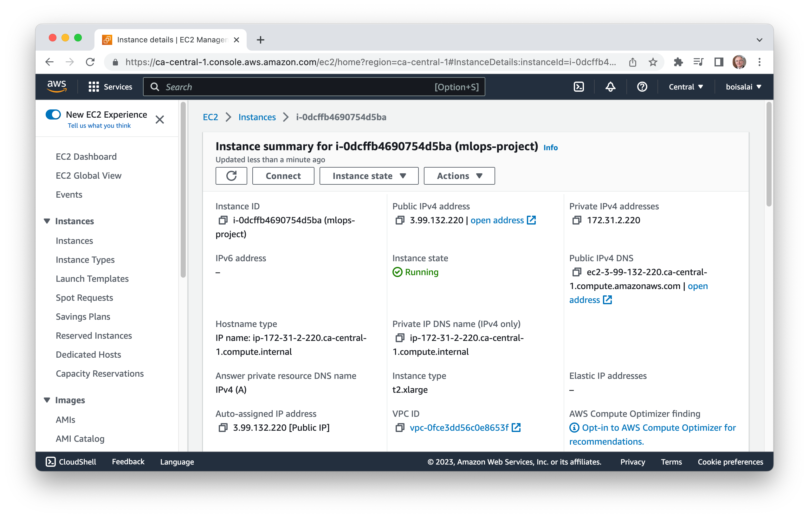

<div align="center">
<h1>Used Car Price Prediction (MLOps Zoomcamp Project)</h1>


<a href="https://opensource.org/license/mit/">

</a>

[Problem](#problem-statement) | [Dataset](#dataset) | [Architecture](#architecture) | [Instructions](#instructions) | [Best practices](#best%20practices) | [License](#license) | [Acknowledgments](#acknowledgments)

</div>

## Problem Statement

This project is the capstone associated with [MLOps Zoomcamp](https://github.com/DataTalksClub/mlops-zoomcamp), and it will undergo peer review and scoring.

The ultimate objective of this project is to create an end-to-end machine learning solution encompassing feature engineering, 
training, validation, tracking, model deployment, hosting for production, and adhering to general engineering best practices. 

The problem at hand is to model the selling price of used cars based on the features given in the datasets. 
It will be used by the client to predict the price of a car of their choice. 

## Dataset

I used [Kaggle's used car data set](https://www.kaggle.com/datasets/austinreese/craigslist-carstrucks-data) 
because it had a variety of categorical and numerical data and allows you to explore different ways of dealing
with missing data.

The Kaggle dataset "austinreese/craigslist-carstrucks-data" is a collection of data on used car prices in Austin,
Texas, scraped from Craigslist. The dataset contains information on various car models, years, and prices, as well
as additional features such as mileage, fuel type, and transmission type.

Here's a breakdown of the dataset's structure:

* The dataset contains 426,880 entries and 26 columns.
* The variables include:
  * "id": a unique identifier for each car listing
  * "manufacturer": the make of the vehicle
  * "model": the model of the vehicle
  * "year": the year of the vehicle
  * "price": the listing price of the vehicle
  * "odometer": the mileage on the vehicle
  * "fuel": the fuel method of the vehicle (e.g., gasoline, diesel, hybrid)
  * "transmission": the car's transmission type (e.g., automatic, manual)
  * "posting_date": the listing date of the vehicle on Craiglist

## Design & flow architecture

The architecture below depicts the system design:

To complete

## Instructions

For those who don't want to replicate the project in AWS, I've added a section to run part of the project on your local machine.

### Setting up for local environment

I assume Anaconda, Docker, Docker-Compose, Git and Make are already installed. Otherwise, see
[here](https://github.com/DataTalksClub/mlops-zoomcamp/blob/main/01-intro/README.md#12-environment-preparation)
and [here](https://www.youtube.com/watch?v=F6DZdvbRZQQ&list=PL3MmuxUbc_hIUISrluw_A7wDSmfOhErJK&index=52) for instructions.

**Note**: I have tested the codes on M1 MacBook Pro. It can certainly be run on Linux and Windows with small modifications.

1. Clone the repository, and navigate to the downloaded folder.

```bash
$ git clone https://github.com/boisalai/mlops-zoomcamp-project.git
$ cd mlops-zoomcamp-project
```

2. Create and activate a new environment named `mlops-project` with Python 3.9. If prompted to proceed with the installation (`Proceed ([y]/n)?`), type `y`.

Run these commands:

```bash
$ conda create -n mlops-project python=3.9
$ conda activate mlops-project
```

:warning: **Apple Silicon and the Library Incompatibility Issue**

I encountered compatibility problems between "arm64" and "x86_64" Python dependencies on my MacBook Pro M1. 
Certain dependencies are not compatible with the ARM architecture, necessitating the creation of an environment using x86 builds.

To resolve this issue, I followed the instructions provided [here](https://conda-forge.org/docs/user/tipsandtricks.html) 
in the section titled Installing Apple Intel Packages on Apple Silicon. For Apple Silicon M1 or M2, execute the following commands:

```bash
$ CONDA_SUBDIR=osx-64 conda create -n mlops-project python=3.9
$ conda activate mlops-project
$ conda config --env --set subdir osx-64
```

You can proceed to the next steps as normal.

3. Install requirements for the environment.

Install all package dependencies with this command.

```bash
$ pip install -r requirements.txt
```

4. Authenticate with Kaggle using `kaggle.json`.

The `kaggle.json` file is typically used to authenticate API requests to the Kaggle service. 
It contains the necessary credentials for the Kaggle API, allowing you to interact with Kaggle datasets, competitions, and other 
resources programmatically.

Navigate to https://www.kaggle.com. Go to the [Account tab of your user profile](https://www.kaggle.com/me/account) and select Create API Token. 
This will trigger the download of `kaggle.json`, a file containing your API credentials.

Move the `kaggle.json` file to one of these folders: `~/downloads/kaggle.json`, `~/.kaggle/kaggle.json` or `./kaggle.json`. 

The script code will look for the `kaggle.json` file to set the environment variables.

5. Start Prefect.

Start a local Prefect server by running the following.

```bash
$ prefect server start
```

You should see this.

```txt
 ___ ___ ___ ___ ___ ___ _____ 
| _ \ _ \ __| __| __/ __|_   _| 
|  _/   / _|| _|| _| (__  | |  
|_| |_|_\___|_| |___\___| |_|  

Configure Prefect to communicate with the server with:

    prefect config set PREFECT_API_URL=http://127.0.0.1:4200/api

View the API reference documentation at http://127.0.0.1:4200/docs

Check out the dashboard at http://127.0.0.1:4200
```

Open another terminal window and run the following commands to set the Prefect API URL.

```bash
$ conda activate mlops-project
$ prefect config set PREFECT_API_URL=http://localhost:4200/api
```

You should see this.

```txt
Set 'PREFECT_API_URL' to 'http://127.0.0.1:4200/api'.
Updated profile 'default'.
```

Open the Prefect Dashboard at http://127.0.0.1:4200. You should see this.


6. Start MLflow UI.

```bash
$ mlflow ui --backend-store-uri sqlite:///mlflow.db
```

Then, open the MLflow UI on http://127.0.0.1:5000/. You should see this.


7. Train the model.

In another terminal, run the following commands.

```bash
$ conda activate mlops-project
$ make train
```

This step involves the following tasks:

* Downloading the data from Kaggle.
* Performing feature engineering on the data.
* Preparing the datasets for training.
* Training the model using multiple hyperparameter combinations.
* Re-training the model using the best hyperparameters.
* Registering the model in the MLFlow staging area.
* All of these tasks are orchestrated using Prefect.
  
You should see something like this.

<table>
    <tr>
        <td>
            <b>Terminal<b><br>
            
        </td>
        <td>
            <b>Prefect Dashboard<b><br>
            
        </td>
        <td>
            <b>Prefect Dashboard<b><br>
            
        </td>
    </tr>
</table>


8. Test the model.

```bash 
$ make test
```

TODO

9. Deploy the model to production

```bash
$ make deploy 
```

TODO


### Setting up for AWS cloud environment

Follow the steps 1 to 7 below.

#### Step 1: Create an AWS Account

Go to [AWS Management Console](https://aws.amazon.com/console/), click on **Create an AWS Account** and follow steps.

Select your **Default Region** (mine is `Canada (Central) ca-central-1`).

### Step 2: Create a new instance

From your **AWS Console**, select **EC2** and then click on **Launch instance**.

Create a new instance with the name **mlops-project**.


Select:

* **Amazon Machine Image (AMI)**: Ubuntu Server 22.04 LTS (HVM), SSD Volume Type
* **Architecture**: 64-bit (x86)


Choose **Instance type**: t2.xlarge.


Click on **Create new key pair** with:

* **Key pair name**: razer
* **Key pair type**: RSA
* **Private key file format**: .pem


Click on **Create key pair** button, than move the downloaded `razer.pem`  file to the `~/.ssh` folder on your local machine.
Than change the permissions to protect the file against the accidental overwriting, removing, renaming or moving files.

```bash
$ mv ~/downloads/razer.pem ~/.ssh
$ chmod 400 ~/.ssh/razer.pem 
```

Increase **Configure storage** to 30 GiB.


Finally, click the **Launch instance** button.

You should see something like this.



Take note of the **Public IPv4 address** (mine is `3.99.132.220`).

### Step 3: Connect local machine to the EC2 instance

Connect to this instance with the following commands.
Don't forget to replace the public IP with your own (mine is `3.99.132.220`).

```bash
$ ssh -i ~/.ssh/razer.pem ubuntu@3.99.132.220
```

You should see this.


We are now connected to the remote service.

Enter `logout` to close the connection.

```bash
$ logout
```

You don't need to run the previous command every time. Just create a config file `~/.ssh/config` like this.

```bash
Host mlops-project
    HostName 3.99.132.220
    User ubuntu
    IdentityFile ~/.ssh/razer.pem
    StrictHostKeyChecking no
```

Now, we can connect to our instance with this command.

```bash
# To connect to our instance. 
$ ssh mlops-project
```

Note that every time we stop and restart the instance, we will have to change the public IP address.

### Step 4: Install required packages on the instance

Run the folowing commands on your instance to install MiniConda, Docker and Docker Compose, 
and create a conda environment.

```bash
$ sudo apt update && sudo apt install make
$ git clone https://github.com/boisalai/mlops-zoomcamp-project.git
$ cd mlops-zoomcamp-project
$ make init
```

Log out (with `logout` command) and log back (with `ssh mlops-project` command) in so that your group membership is re-evaluated
and changes to take effect.

```bash
$ logout
Connection to 3.99.132.220 closed.
$ ssh mlops-project
``````

Run the following command on your instance and docker should work fine.

```bash
$ docker run hello-world
``` 

Run the following commands on your instance to activate the conda environment and install the required packages into it.

```bash
$ cd ~/mlops-zoomcamp-project
$ conda create -n mlops-project python==3.9
$ conda activate mlops-project
$ pip install -r requirements.txt
```

### Step 5: Connect Visual Studio Code to your instance

Now, we want access to this remote computer from our Visual Studio Code (VS Code).

Open VS Code from your local machine. 
In VS Code, find and install the **Remote - SSH** extension. 
Then go to the **Command Palette** (`Shift+Cmd+P`), 
select **Remote-SSH: Connect to Host**​, 
select the configured SSH host `mlops-project`,
open `mlops-zoomcamp-project` folder and click on **OK**.

We should see this.


### Step 6: Use Jupyter Notebook from remote machine

On your remote instance, run the following command to start Jupyter notebook.

```bash
$ conda activate mlops-project 
$ jupyter notebook
```

In VS Code connected to your instance, open a terminal.
From the menu, use the **Terminal > New Terminal** or **View > Terminal** menu commands.
Select **PORTS**, click on **Forward a Port** and open the port `8888`.


Copy and paste one of the URLs (I have http://localhost:8888/?token=c8de56fa...) to the web browser, 
you should see that Jupyter notebook is alive.


### Step 7: Authenticating with Kaggle using `kaggle.json`

With Jupyter, open the `notebooks/used-car-price-prediction.ipynb` notebook.

Navigate to https://www.kaggle.com. 
Then go to the [Account tab of your user profile](https://www.kaggle.com/me/account) and click on **Create New Token** button. 
This will trigger the download of `kaggle.json`, a file containing your API credentials.

You need to copy this key on your instance. 

To do so, drag the `kaggle.json` file you downloaded on your local machine 
to the `~/mlops-zoomcamp-project` in the VS Code connected to the instance.

Or just run the following command after changing the **Public IPv4 DNS** (mine is `ec2-3-99-132-220.ca-central-1.compute.amazonaws.com`).

```bash
scp -i ~/.ssh/razer.pem ~/downloads/kaggle.json ubuntu@ec2-3-99-132-220.ca-central-1.compute.amazonaws.com:~/mlops-zoomcamp-project
```

# Je suis rendu ici...


```bash
# Configure your AWS acoount
aws configure
# Create key pair to connect AWS
aws ec2 create-key-pair --region eu-central-1 --key-name mlops --query 'KeyMaterial' --output text > ~/.ssh/mlops.pem
```


```bash
pip install -U pip --upgrade pip
pip install pipenv
git clone https://github.com/boisalai/mlops-zoomcamp-project.git
cd mlops-zoomcamp-project
```

Install from Pipfile and activate the Pipenv shell:

```bash
$ pipenv install
$ pipenv shell
$ python --version
Python 3.9.17
```

Connect the environment to a kernel and start jupyter:

```bash
python -m ipykernel install --user --display-name pipenv_test --name pipenv_test
jupyter notebook
```

## License

The code and checkpoints are licensed under [MIT License](https://opensource.org/license/mit/).

## Acknowledgments

I am deeply grateful for the effort this fantastic group of individuals has invested in ensuring our understanding of the different facets of MLOps.

* Alexey Grigorev
* Cristian Martinez (MLflow)
* Jeff Hale (Prefect)
* Bianca Hoch (Prefect)
* Emeli Dral (Evidently)
* Sejal Vaidya (IaC and Terraform)
