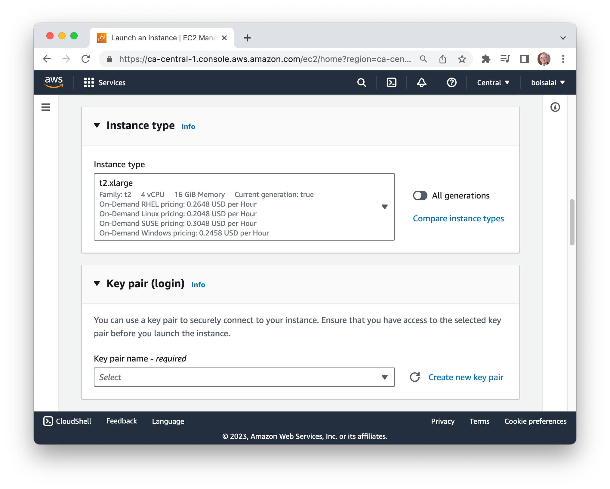

<!--
<p align="center" width="100%"></p>
-->

# Project

## Setup

Follow the instructions in this [video](https://www.youtube.com/watch?v=IXSiYkP23zo&list=PL3MmuxUbc_hIUISrluw_A7wDSmfOhErJK)
to prepare the environment or follow the steps 1 and 2 below.

### Step 1: Create an AWS Account

Go to [AWS Management Console](https://aws.amazon.com/console/), click on **Create an AWS Account** and follow steps.

Select your **Default Region** (mine is `Canada (Central) ca-central-1`).

### Step 2: Create a new instance

From your **AWS Console**, select **EC2** and then click on **Launch instance**.

Create a new instance with the name **mlops-zoomcamp**.


Select:

* **Amazon Machine Image (AMI)**: Ubuntu Server 22.04 LTS (HVM), SSD Volume Type
* **Architecture**: 64-bit (x86)


Choose **Instance type**: t2.xlarge.



Click on **Create new key pair** with:

* **Key pair name**: razer
* **Key pair type**: RSA
* **Private key file format**: .pem


Click on **Create key pair** button, than move the downloaded `razer.pem`  file to the `~/.ssh` folder on your local machine.

Increase **Configure storage** to 30 Gb.


Finally, click the **Launch instance** button.

You should see something like this.


Take note of the **Public IPv4 address** (mine is `99.79.47.77`).

### Step 3: Connect local machine to the EC2 instance

Connect to this instance with the following commands.
Don't forget to replace the public IP with your own (mine is `3.99.223.16`).

```bash
$ chmod 400 ~/.ssh/razer.pem 
$ ssh -i ~/.ssh/razer.pem ubuntu@3.99.223.16 
```


# Je suis rendu ici...


```bash
# Configure your AWS acoount
aws configure
# Create key pair to connect AWS
aws ec2 create-key-pair --region eu-central-1 --key-name mlops --query 'KeyMaterial' --output text > ~/.ssh/mlops.pem
```


```bash
$ pip install -U pip --upgrade pip
$ pip install pipenv
$ git clone https://github.com/boisalai/mlops-zoomcamp-project.git
$ cd mlops-zoomcamp-project
```

Install from Pipfile and activate the Pipenv shell:

```bash
$ pipenv install
$ pipenv shell
$ python --version
Python 3.9.17
```

Connect the environment to a kernel and start jupyter:

```bash
$ python -m ipykernel install --user --display-name pipenv_test --name pipenv_test
$ jupyter notebook
```